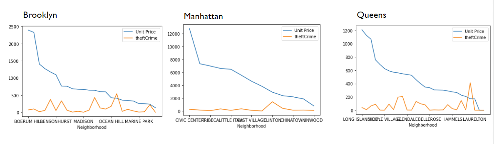
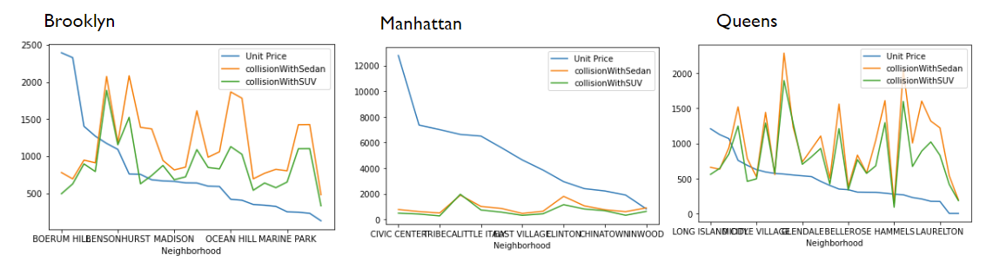
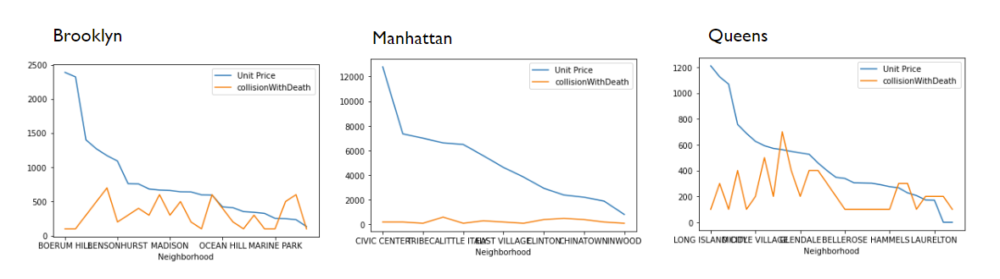
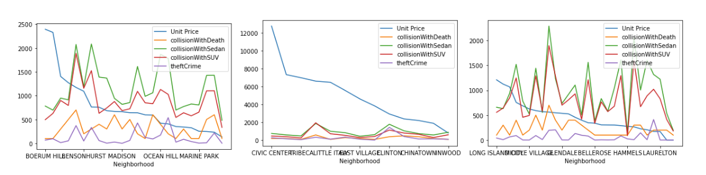
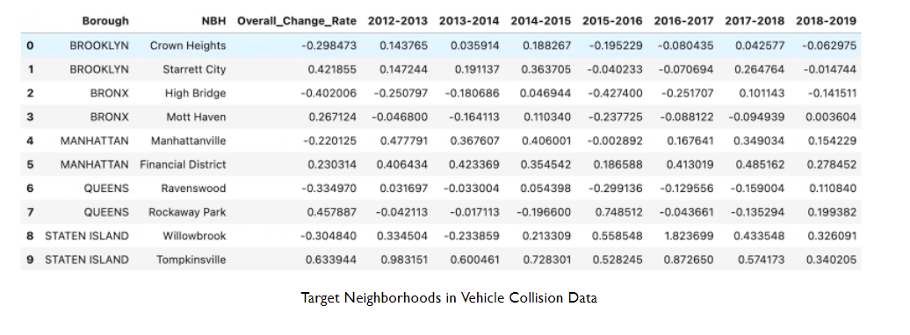
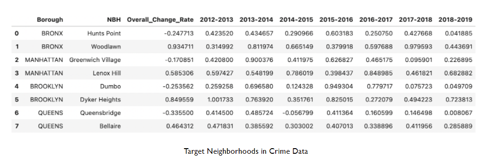
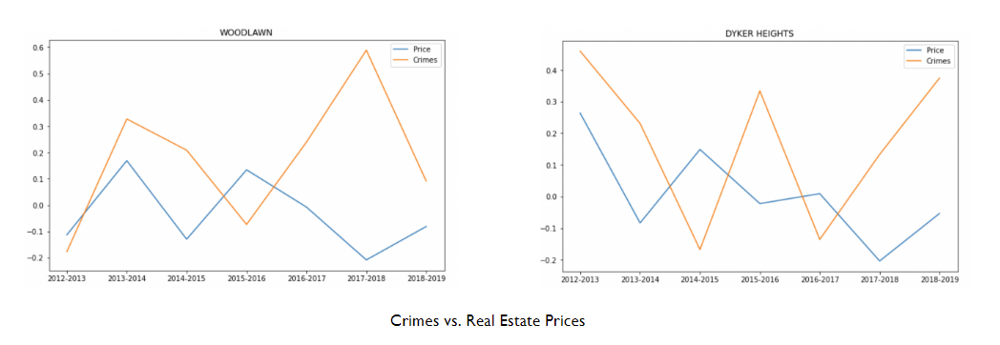
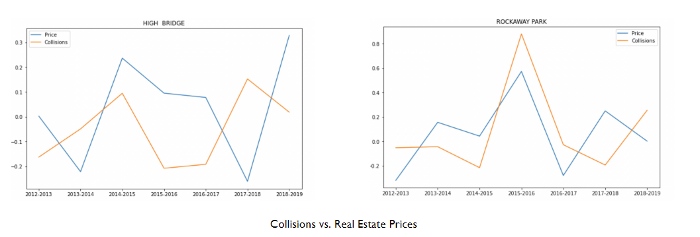
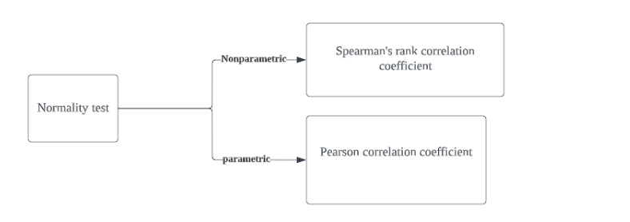
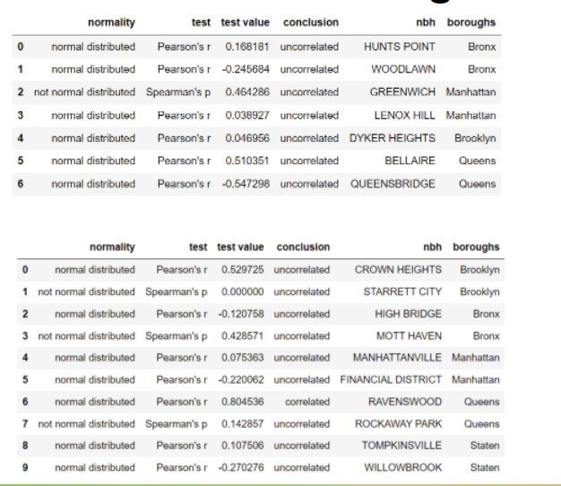

# IS 597 Final project

##Explore The Relationship Between Negative Incident and Real-Estate Sales Price

**The presentation video could be found at** [Presentation Link](https://mediaspace.illinois.edu/media/t/1_yj8te899)

**Team member :**
Jiaqi Zhu, Zhizhou Xu, Weiru Sun

### Dataset Link

Please place all the data in google drive into Data folder
https://drive.google.com/drive/folders/17g9-vD5yFxzRbBP4eGe4BCA-3GHYeHRX?usp=sharing

### Research questions

- HYPOTHESIS 1

The theft type crime is more likely to occurs in the neighborhood that has higher price in real estate.

- HYPOTHESIS 2

Vehicle collisions are more frequent in areas with lower real estate prices.

- HYPOTHESIS 3

Neighborhoods with lower housing prices are more likely to experience serious vehicle collision.(Vehicle collisions with fatalities are defined as serious collisions.)

- HYPOTHESIS 4

The increase of crime and vehicle collision affects the real estate price negatively.
The decrease in vehicle collision and crime will positive affect the real estate price.

### Conclusions

#### HYPOTHESIS 1:

- Reject the hypothesis: Theft-type crime has nothing todo with the estate price in neighborhood.

- Special finding: theft-type crime is more likely to occur in remote areas.

#### HYPOTHESIS 2:

- Reject the hypothesis:There is no relationship between Vehicle collisions and real estate prices.

- Special finding:the num of collisions from different collision types has a significant correlation with each other.

#### HYPOTHESIS 3:

- Reject the hypothesis: After the first decrease curve, which may be due to the lack of previous data, there is a visible common trend for serious vehicle collisions and estate prices.

- Special finding:heft related arrest happens more in the neighborhood with more collision.

#### HYPOTHESIS 4:

- The target neighborhood:
  
  

- Change rate comparison
  
  

- correlation calculation

  - calculation method (Nayak & Hazra, 2011):
    

  - calculation result:

  

- Reject the hypothesis: did not find a consistent relationship or statistical correlation between the crime and estate price, nor between the vehicle collision and the price.

### Reference:

Nayak, B. K., &amp; Hazra, A. (2011). How to choose the right statistical test? Indian Journal of Ophthalmology, 59(2), 85. https://doi.org/10.4103/0301-4738.77005
